# pycharm的使用介绍

## 创建工程

* pycharm必须有工程

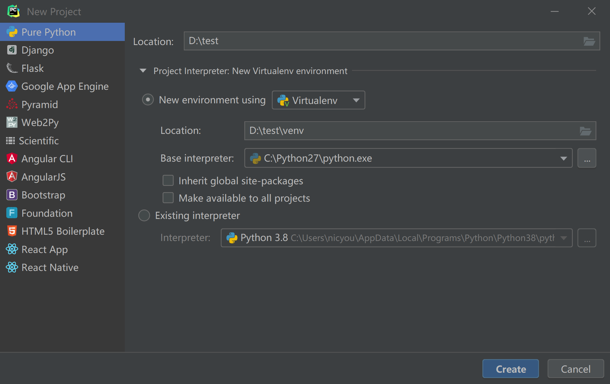

创建独立python运行环境 - Python虚拟环境

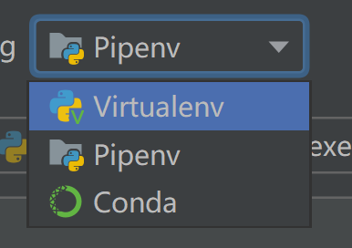

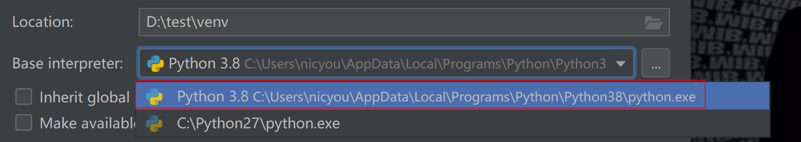

点击create，会创建独立python虚拟环境

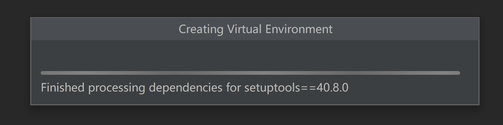

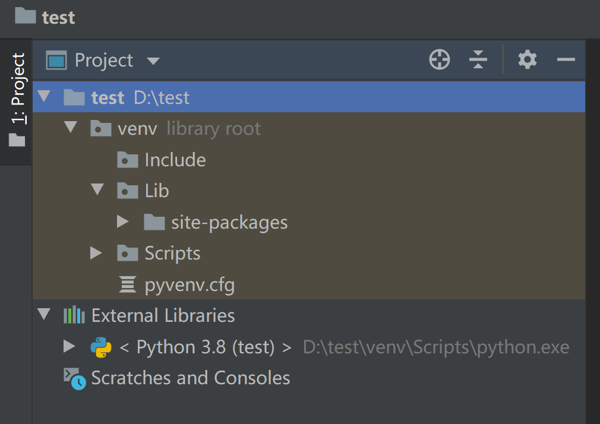

## 虚拟目录作用

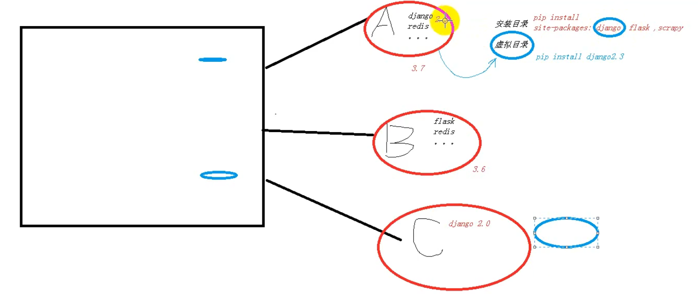

* 各回各家，各找各妈
* 针对项目的依赖放到同一个目录

## 创建新py脚本

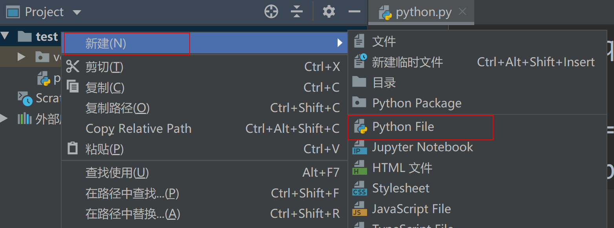

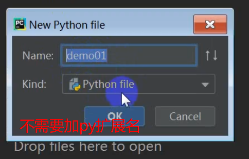

## 运行py脚本

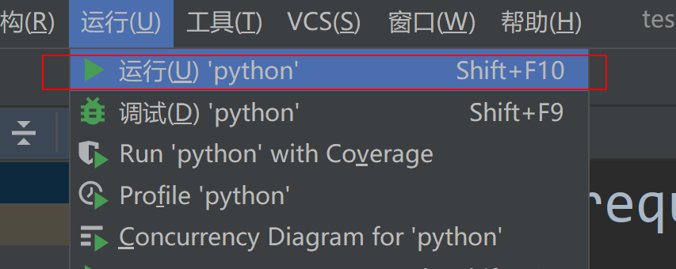

**shift+F10**

## 选择运行的py环境

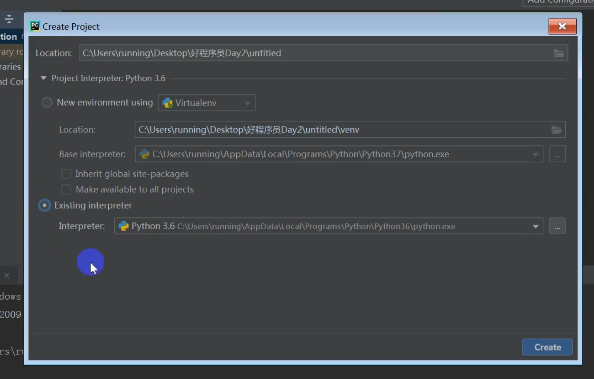

在工程设置中选择运行环境，除非有环境依赖，初级阶段都用默认解析器即可

## 添加第三方库

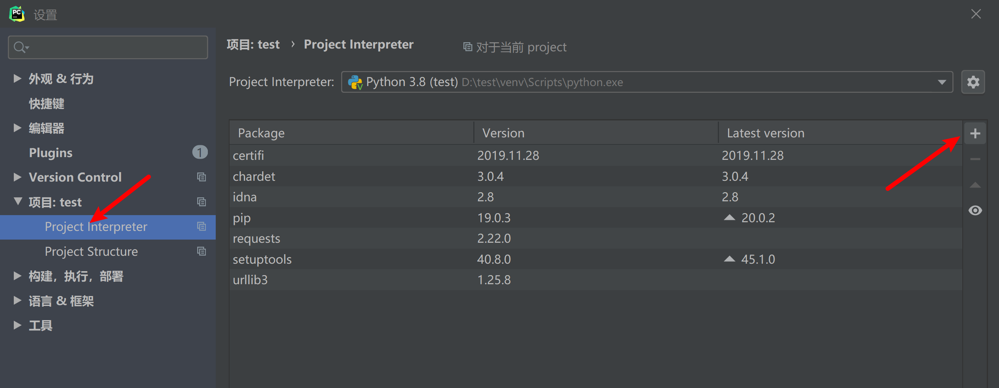

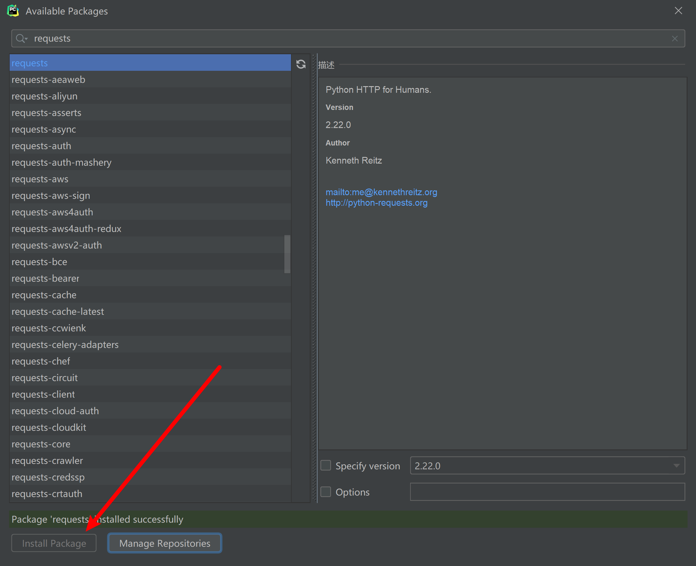

## 修改py解释器

在工程的配置中修改

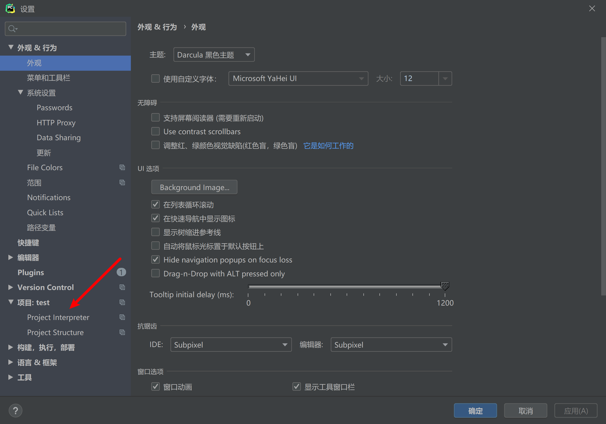

## pycharm快捷键

* 支持eclipse快捷键

---
