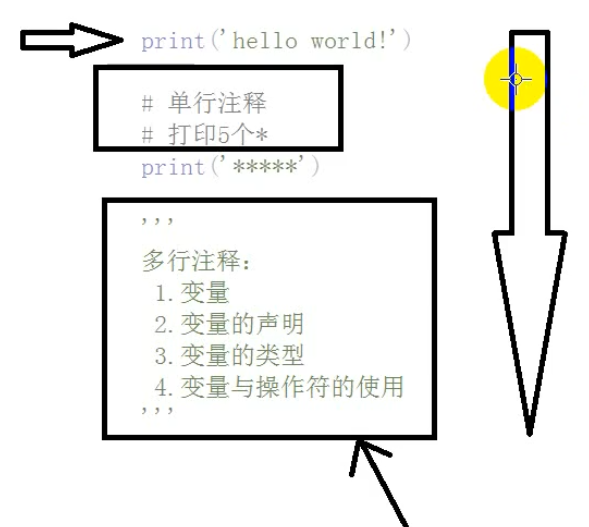
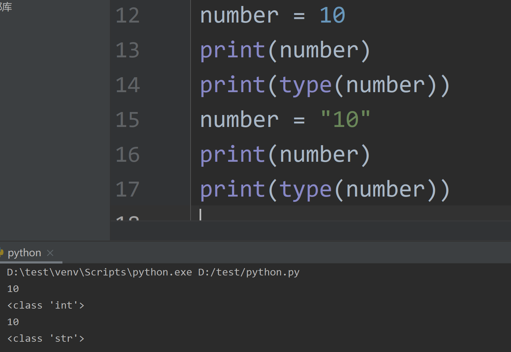
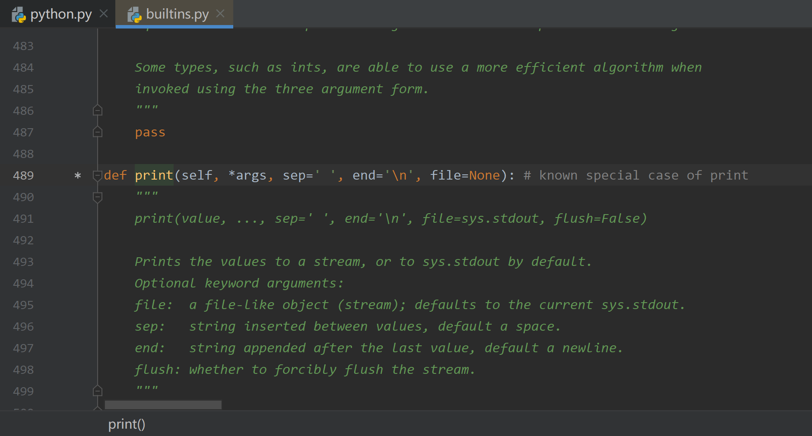
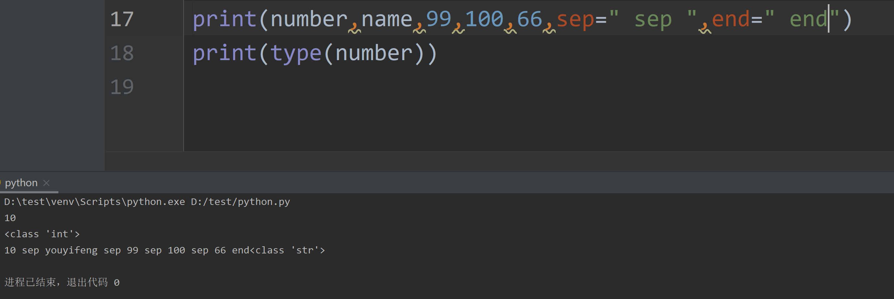
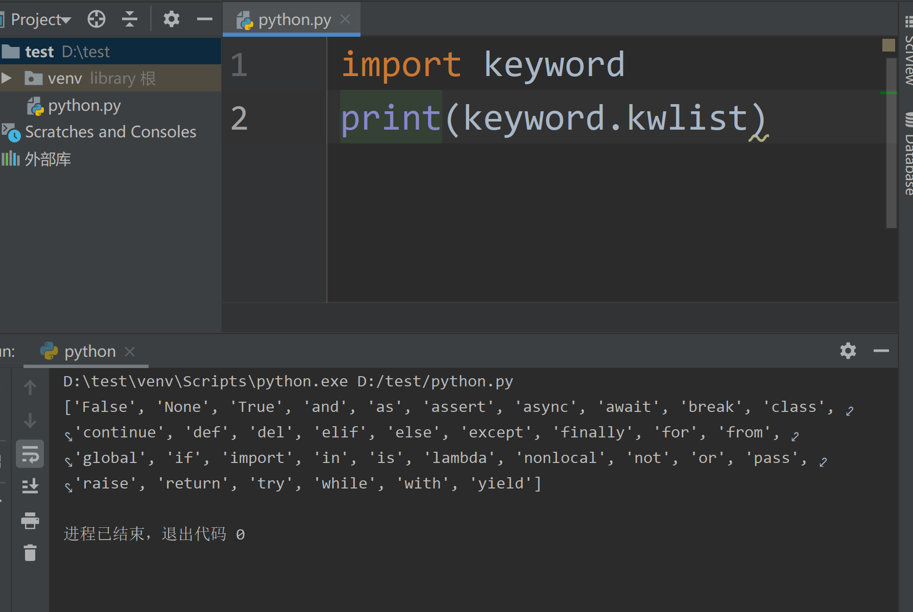

# 变量命名

## python注释

1. 单行注释：以#开头的都是注释
2. 多行注释：以'''开始和结尾


```
# 单行注释
```

```
'''
多行注释
多行注释
多行注释
'''
```



* 注释有助于版本控制，团队开发
* 解释器跳过不执行


## 变量



* python是弱类型，具体的类型取决于值，无需手动定义数据类型
* 判断变量类型，使用type函数，内置函数，参数就是变量名


## 跳转函数定义



鼠标移动到函数，按住ctrl，可以实现跳转函数实现



查看print函数参数列表，修改分隔符以及结尾

## 变量声明

格式：
```
变量名 = 值
```
## 变量命名规则

1. 字母、数字、下划线（不能用+ - * / [] () ）
2. 不能**数字**开头
3. 不能使用关键字
4. 区分小写
5. 最好见名知意

命名法:

1. 驼峰法。showName
   * 第一个单词全部小写，之后所有单词首字母大写，其余小写
   * 类名遵循驼峰命名法，但是类首字母必须大写
2. 下划线_命名(**推荐**) show_name print_name


关键字：

如何查看关键字？



```
['False', 'None', 'True', 'and', 'as', 'assert', 'async', 'await', 'break', 'class', 'continue', 'def', 'del', 'elif', 'else', 'except', 'finally', 'for', 'from', 'global', 'if', 'import', 'in', 'is', 'lambda', 'nonlocal', 'not', 'or', 'pass', 'raise', 'return', 'try', 'while', 'with', 'yield']
```


* true不是关键字，Class不是关键字
* 所有在pycharm中显示橘黄色的都是关键字


---
