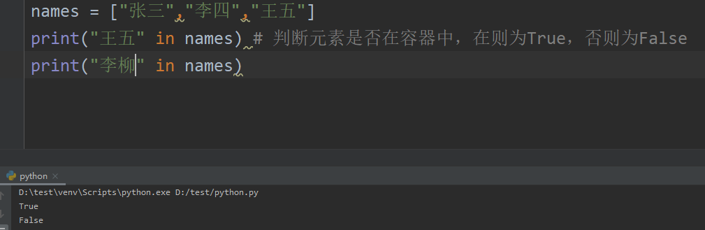
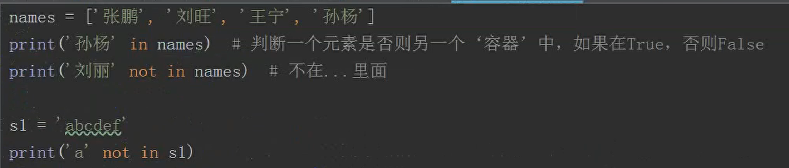
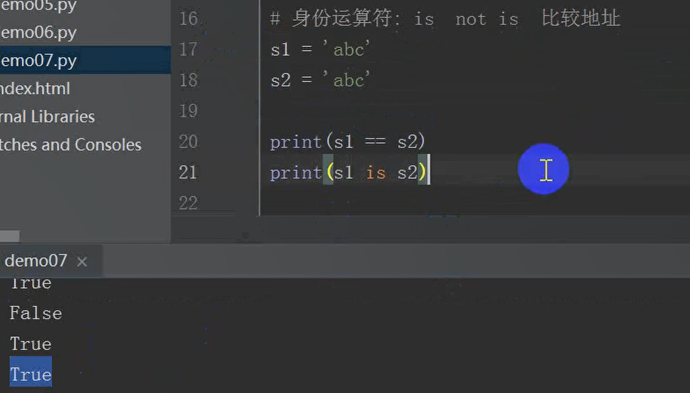
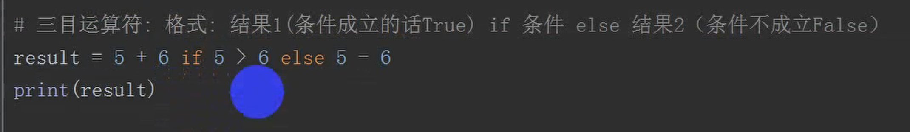
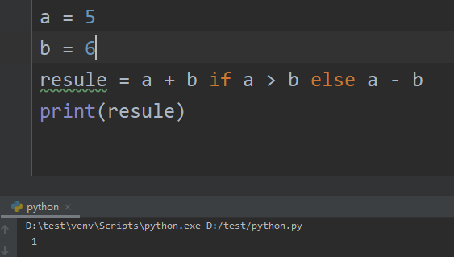
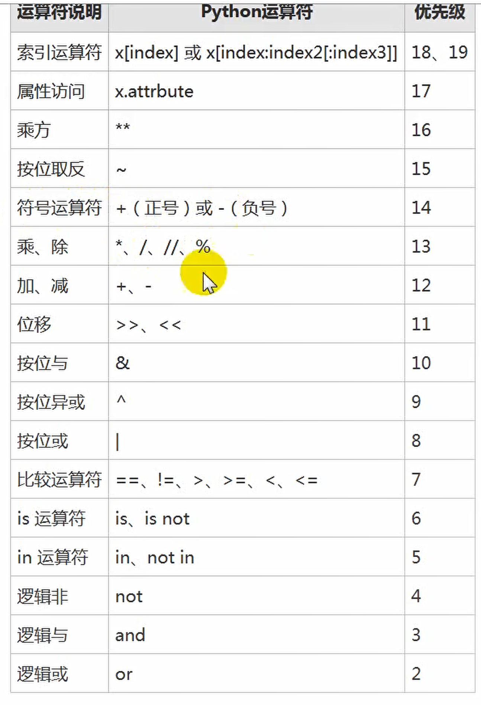
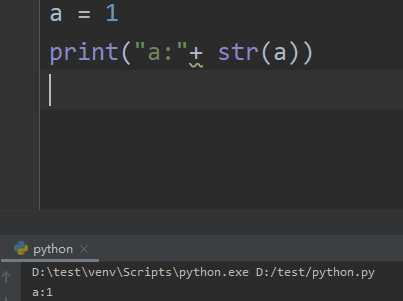
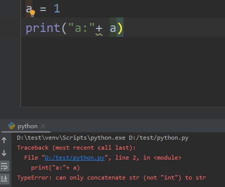
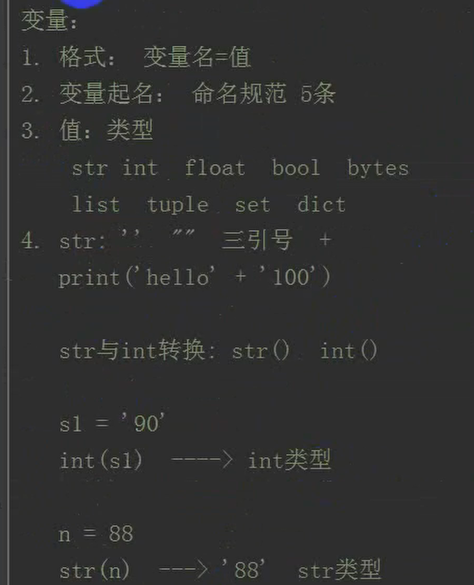
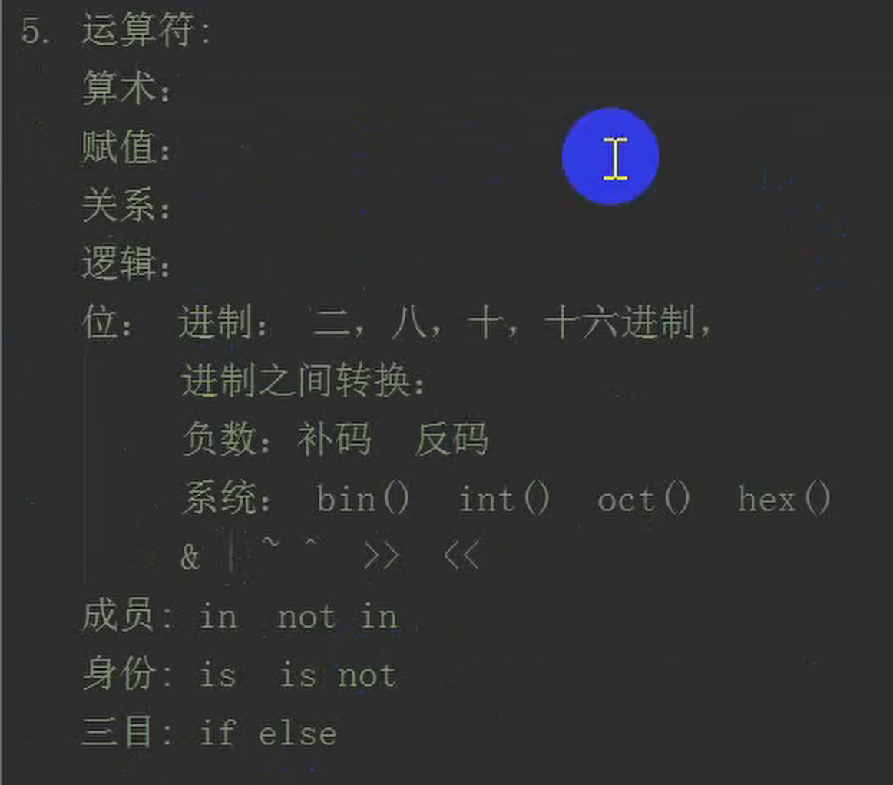

# 成员运算和身份和三目

## 成员运算符

```
in 、 not in
```





## 身份运算符

```
is 、 is not
```

判断地址



Python包括 小整数对象池，intern机制 字符串主流去

## 三目运算符

```
if else
```





## 运算符优先级



有必要刻意去记忆嘛？

## 常量

python没有绝对的常量

1. **全大写变量就是常量**，约定俗成
2. 如果要改随便改

## 总结







 

---
