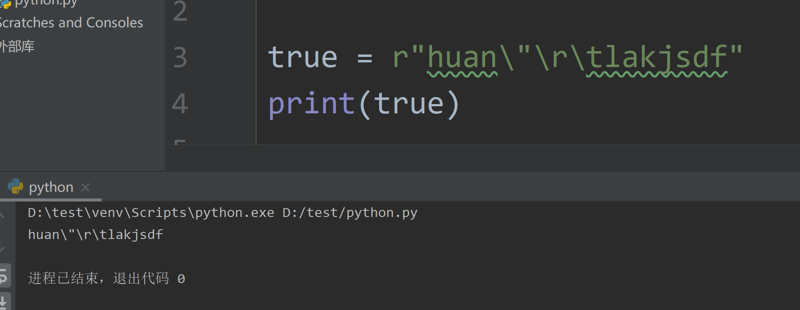
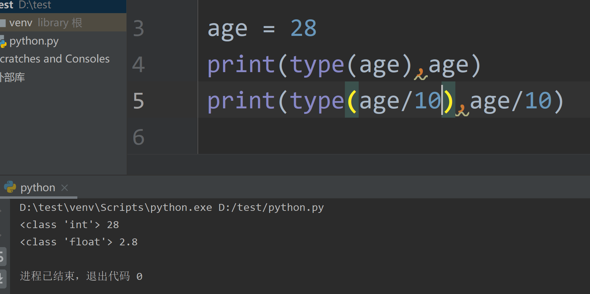
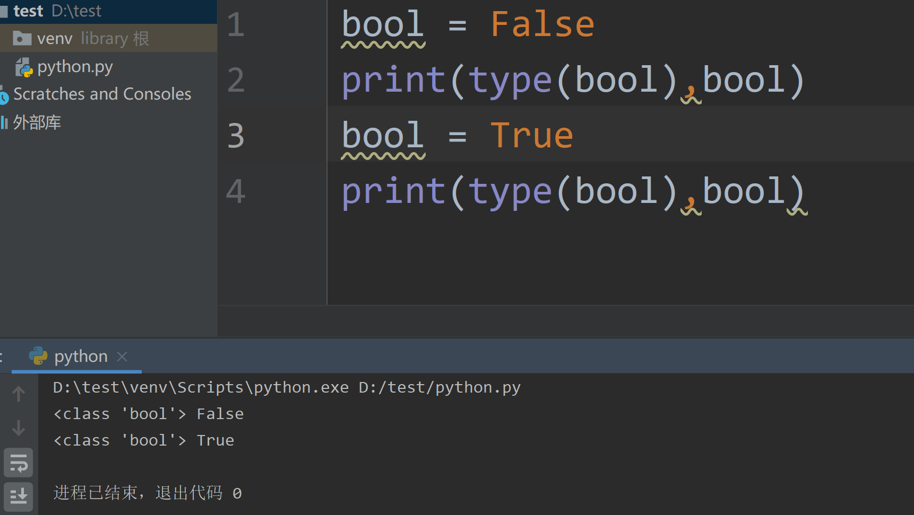
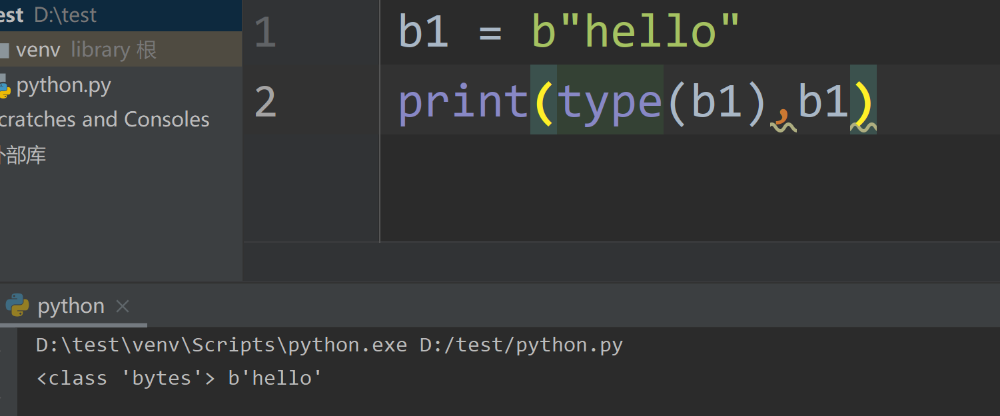
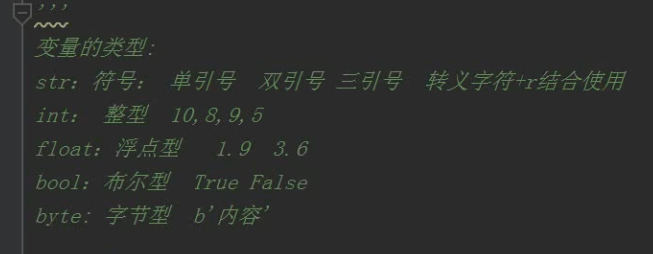
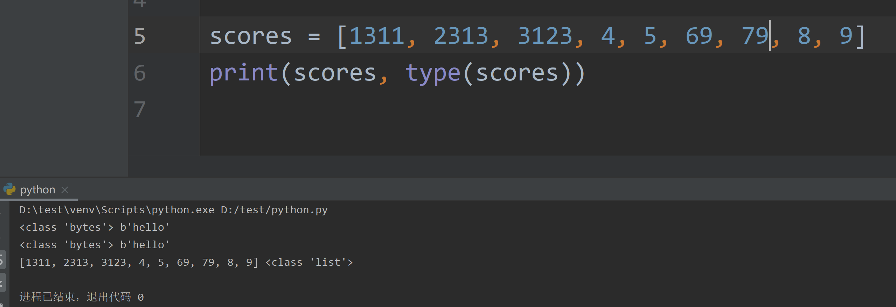
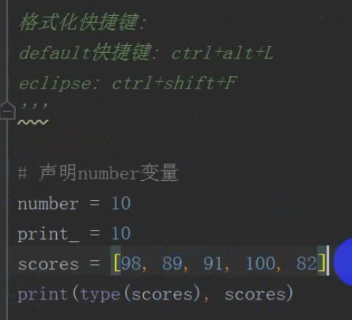
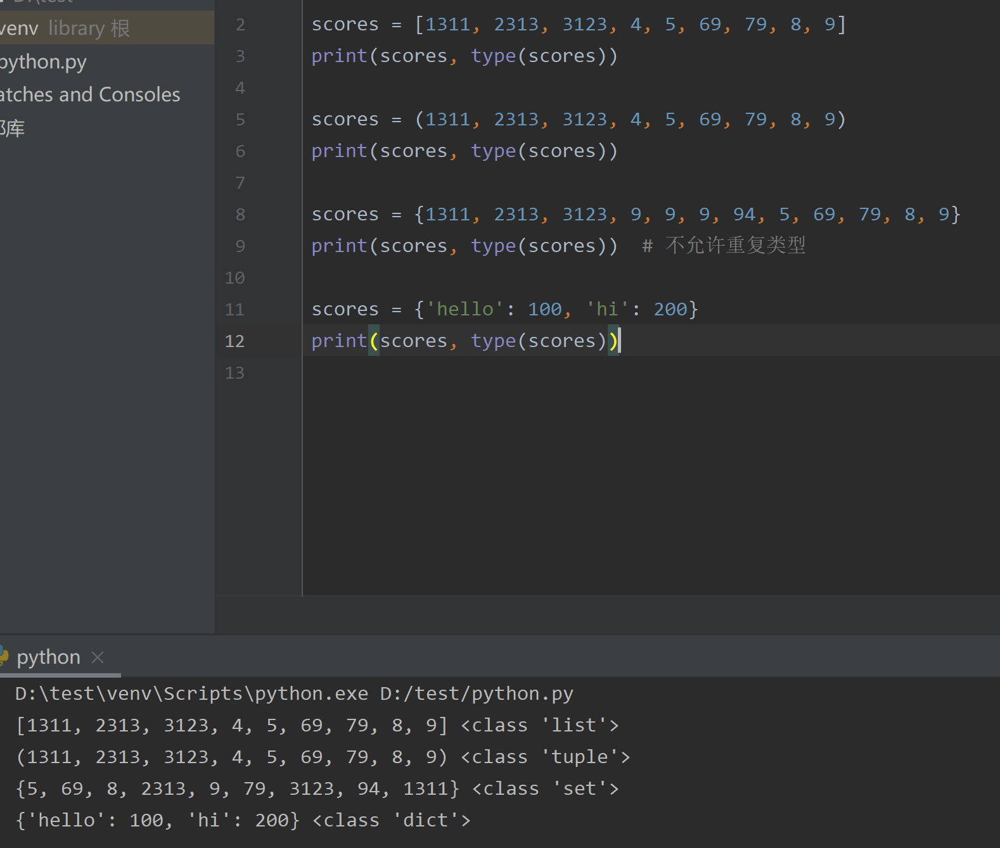
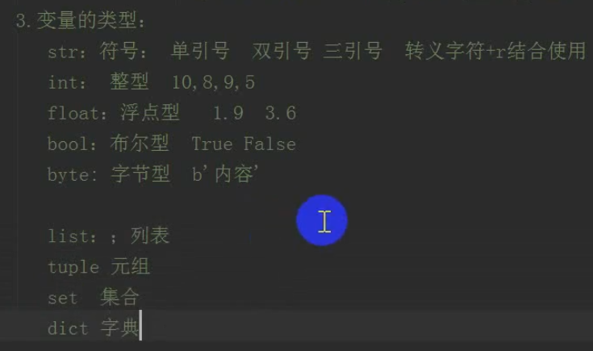

# 数据类型

## 变量类型

包括哪些类型？

```
str
int
float
bool
byte
list
tuple
set
dict

自定义类型，类
```

### 字符串

```
just_name = 'nicyou'

name = "nicyou"

msg = "hello，i love fanfan~"


message = '''
this is long message
very long message
'''
```

1. ''' 保留格式
2. 在Python中使用单引号或双引号是没有区别的，都可以用来表示一个字符串

字符串中常用转义

```
\n 换行
\t tab
\r 回车
\"
\'
\\
```

字符串使用r特性



### 整型

property = 10000000000



## 布尔类型




## byte字节类型

* 字符串前含b表示字节类型






## list列表

* [] 数学中称为中括号，而编程中称为中括号






## tuple元组

* 放在小括号

```
scores = (1311, 2313, 3123, 4, 5, 69, 79, 8, 9)
print(scores, type(scores))
```

## set集合

```
scores = {1311, 2313, 3123, 9, 9, 9, 94, 5, 69, 79, 8, 9}
print(scores, type(scores))  # 不允许重复类型
```

## dict字典



```
scores = {'hello': 100, 'hi': 200}
print(scores, type(scores))
```


* 集合底层使用了字典来实现，集合就是特殊的字典

---

 
