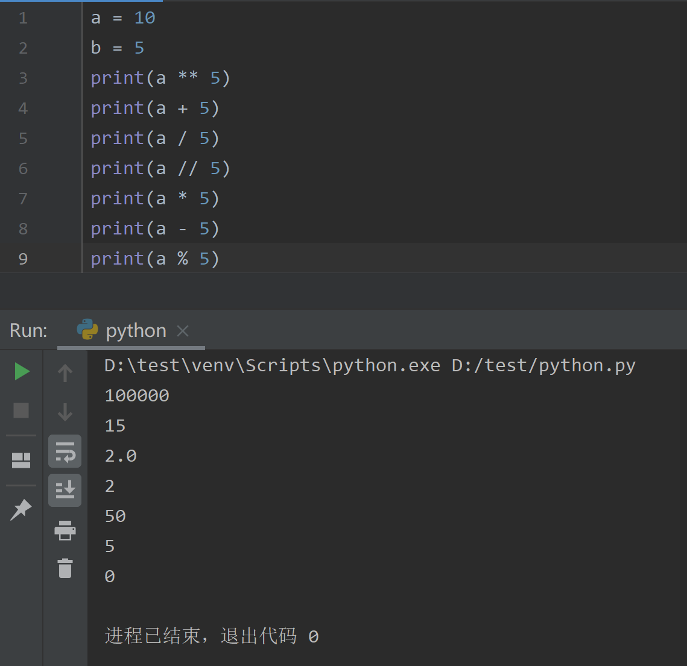
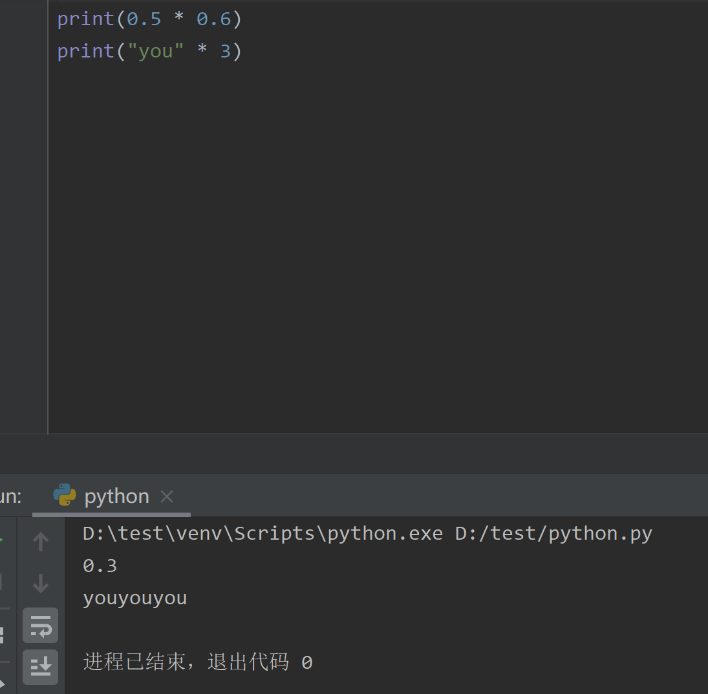
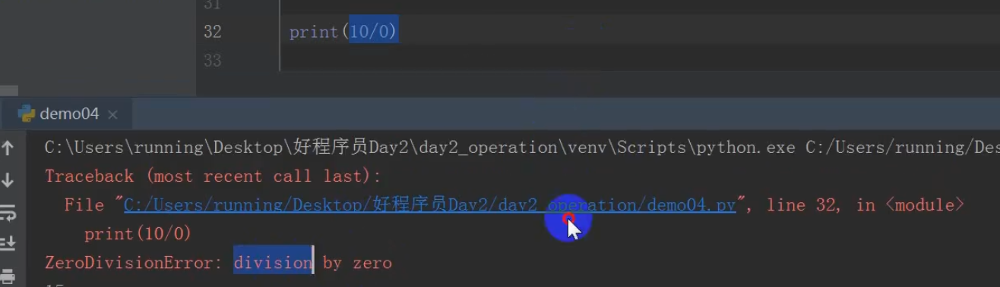
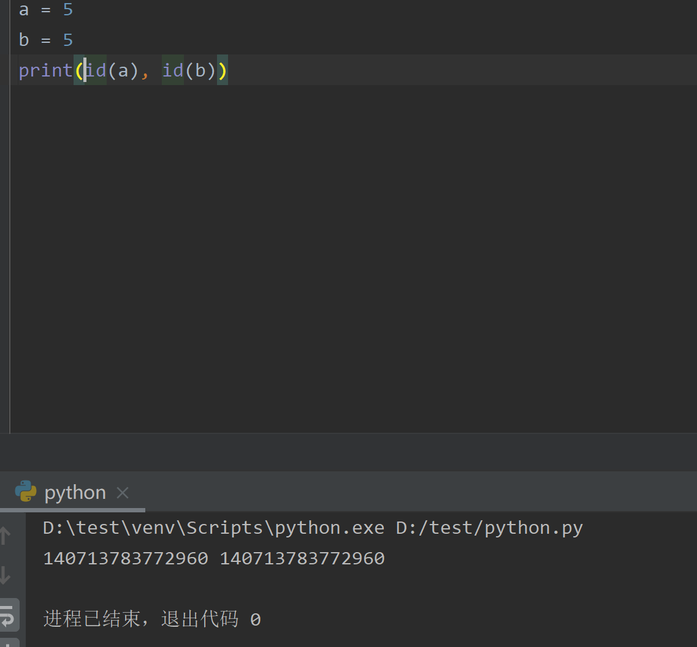
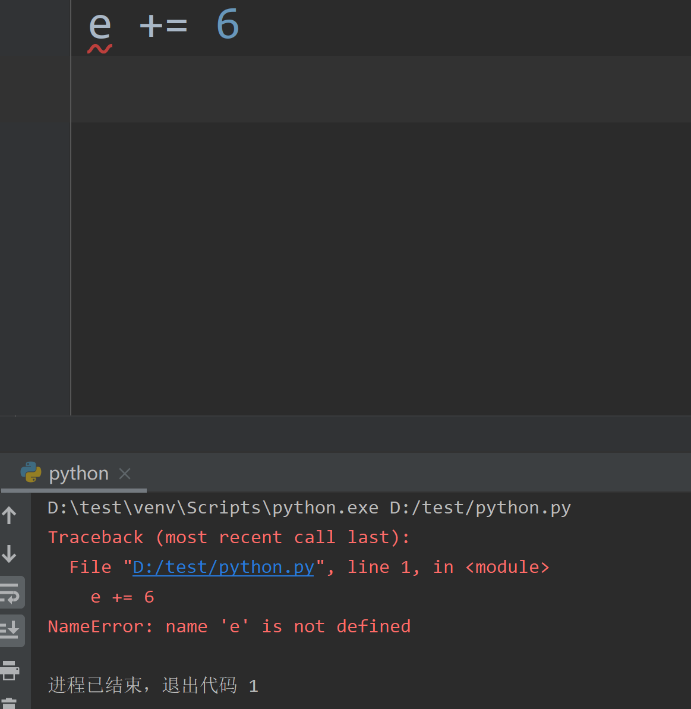
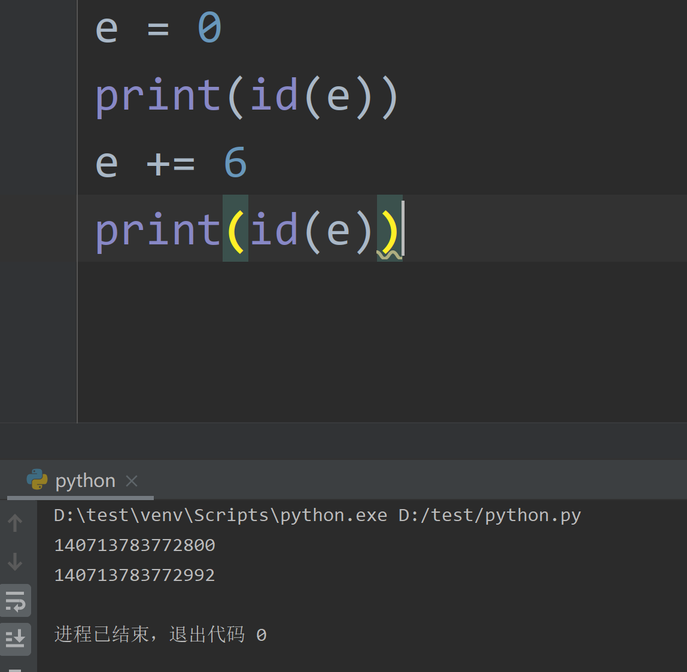

# 算术和赋值运算符

* 关系运算符
* 逻辑运算符
* 位运算符
* 三目运算符
* 算数运算符

## 算数运算符

```
+ - * / ** //
```

1. ** 是次方
2. // 是整除




\+ 运算

* 整型和浮点型就是数值相加
* 字符串类型就是字符串拼接

\* 运算

* 整型和浮点型就是数值相乘
* 字符串就是字符串重复



/ 运算

1. 除数不能为0，解释器运行时错误



\** 次方


## 赋值运算符

变量接收值

```
= += -+ *= /=
```



变量地址一致。内置函数id()，获取变量地址，返回一个整型值


a += 6



必须要有初始值。修改值直接重新开辟新空间存放




---
