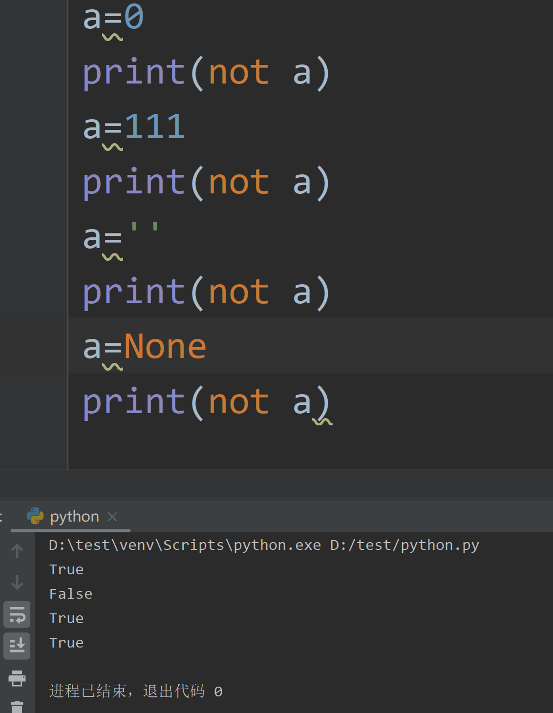
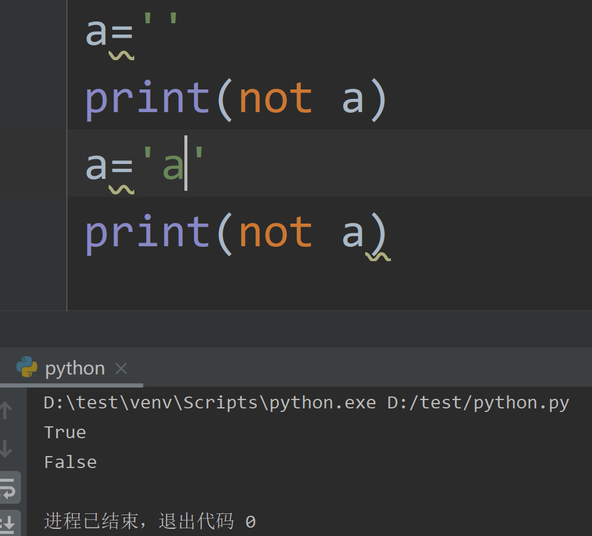
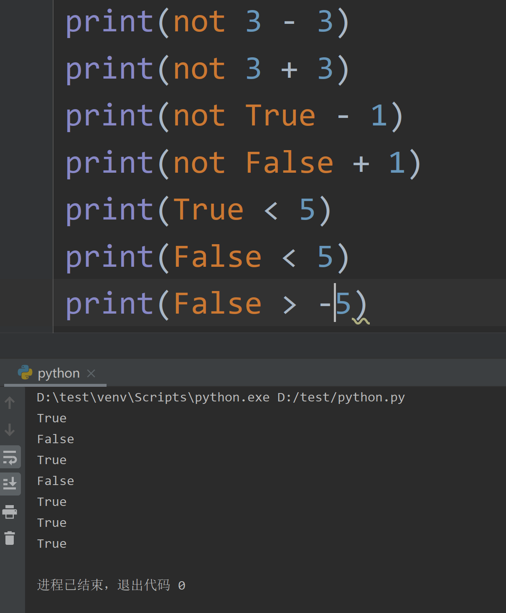
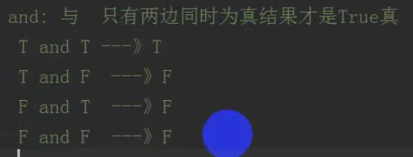
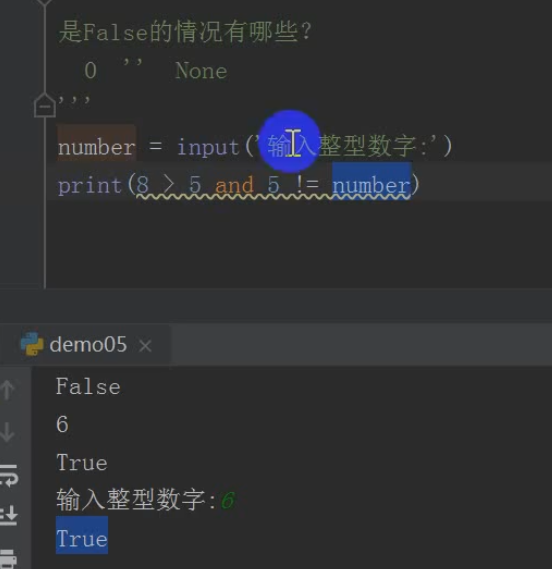
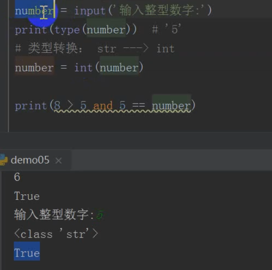
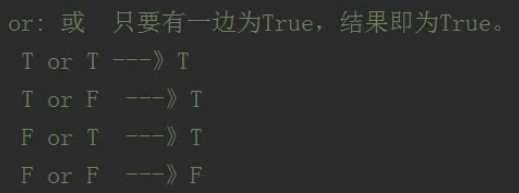

# 逻辑运算符

```
and or not 与或非
```

## not 取反



False情况包括

1. 0
2. 空字符串
3. None

除此之外都是True






## and 与

* 只有两边同时为真结果才是True





input() 获取输入

 

## or 或

* 两边任意为真就是真
* 两边都是False才是False




---
