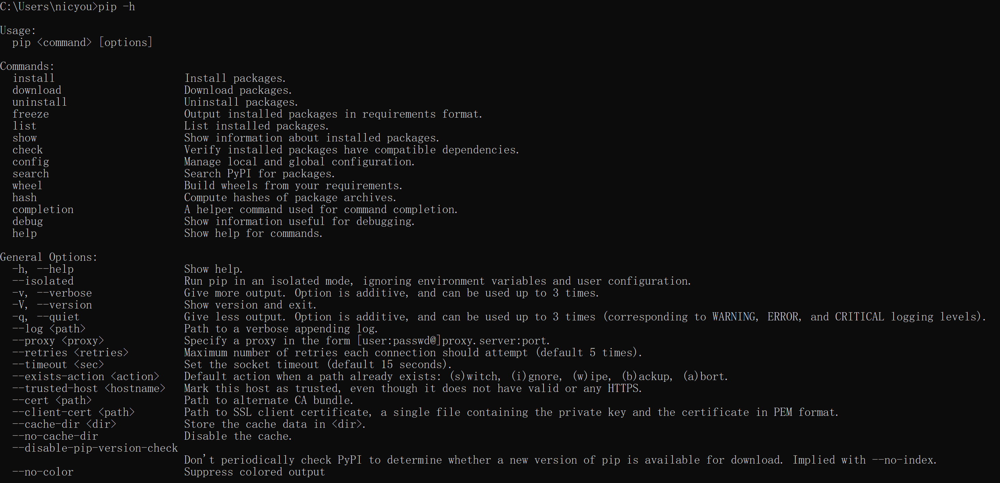
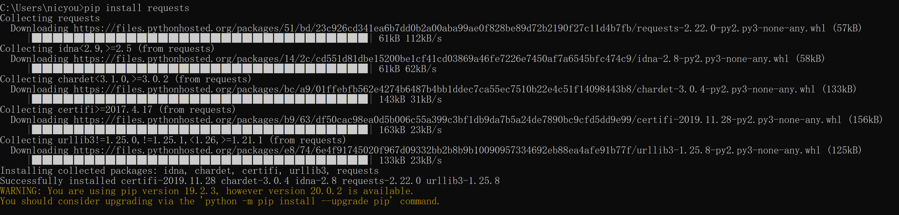
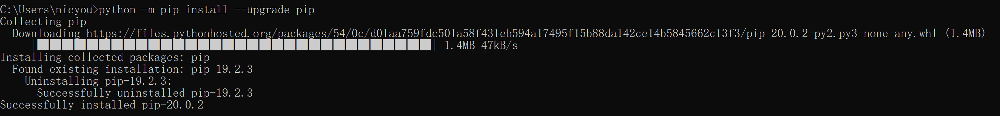

# pip包管理的使用

## pip使用

* 获取帮助信息





更新pip



pip常用命令

```
pip install PACKAGENAME
pip uninstall PACKAGENAME
```

pip 生成requirements

```
C:\Users\nicyou>pip freeze
astroid==2.3.3
certifi==2019.11.28
chardet==3.0.4
colorama==0.4.3
idna==2.8
isort==4.3.21
lazy-object-proxy==1.4.3
mccabe==0.6.1
Pillow==7.0.0
pylint==2.4.4
requests==2.22.0
six==1.14.0
urllib3==1.25.8
wrapt==1.11.2

C:\Users\nicyou>pip list
Package           Version
----------------- ----------
astroid           2.3.3
certifi           2019.11.28
chardet           3.0.4
colorama          0.4.3
idna              2.8
isort             4.3.21
lazy-object-proxy 1.4.3
mccabe            0.6.1
Pillow            7.0.0
pip               20.0.2
pylint            2.4.4
requests          2.22.0
setuptools        41.2.0
six               1.14.0
urllib3           1.25.8
wrapt             1.11.2
```

生成依赖

```
pip freeze > requirements.txt
```

pip 导入requirements

批量安装依赖

```
pip install -r requirements.txt
```
