# python的安装与配置

## 获取安装包

* <https://www.python.org/>

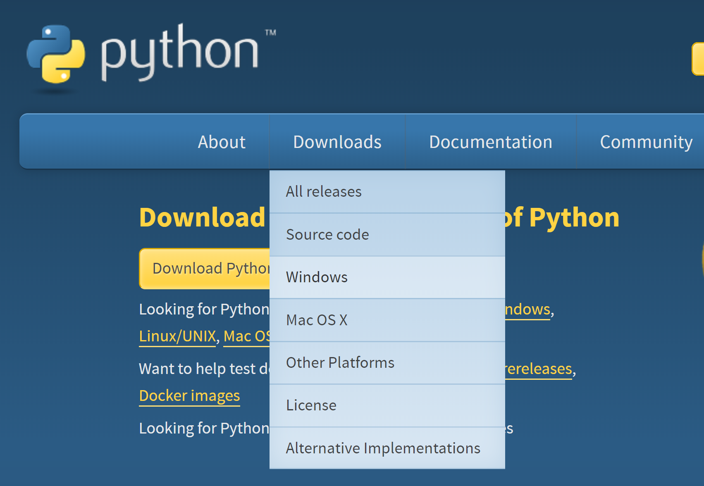

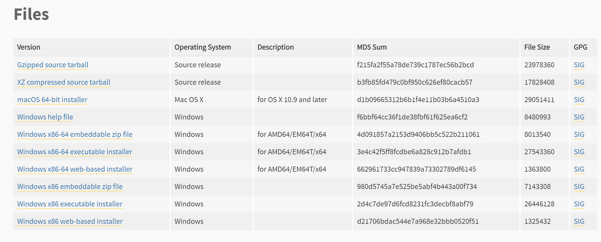

## 安装

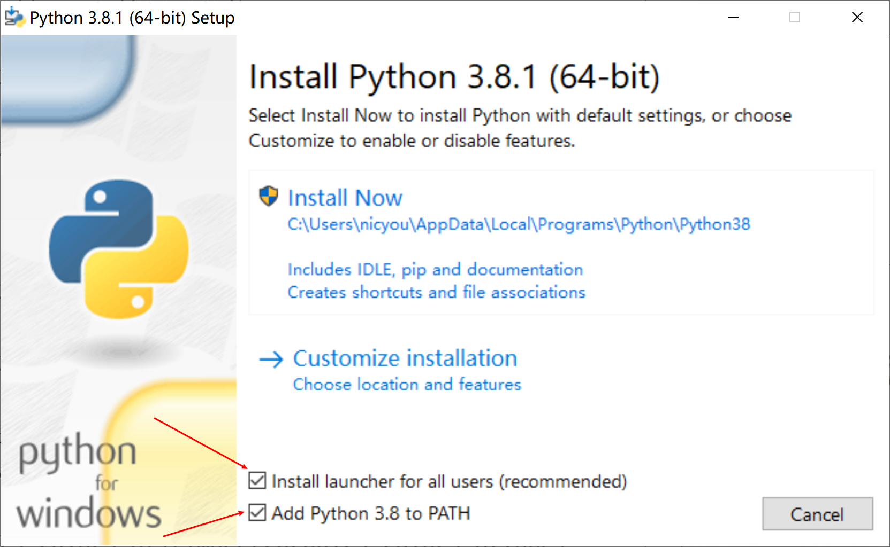

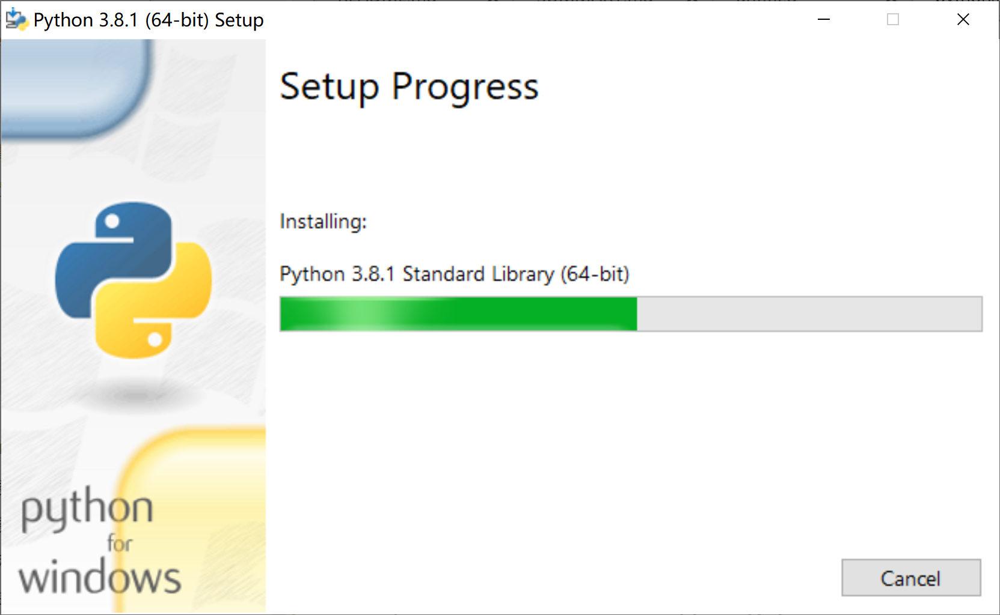

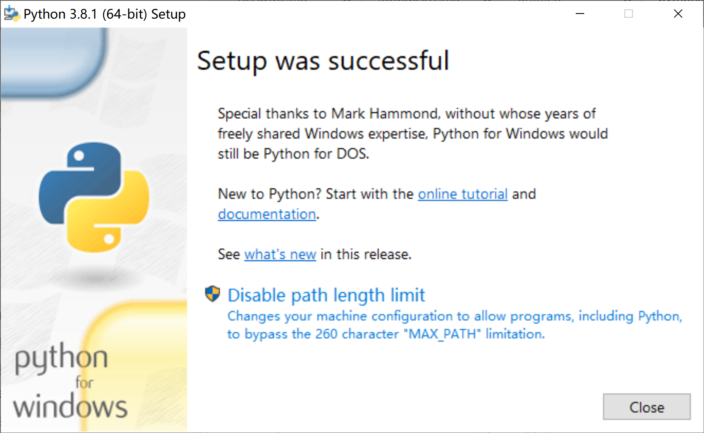

* 取消最长路径配置

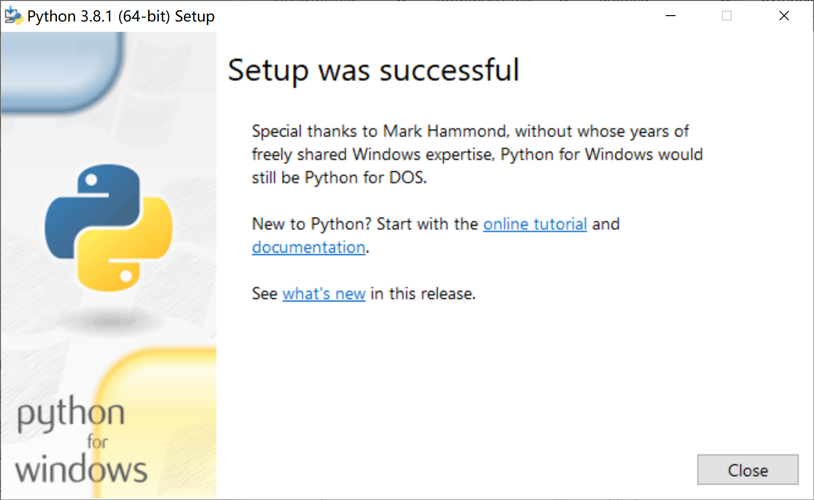

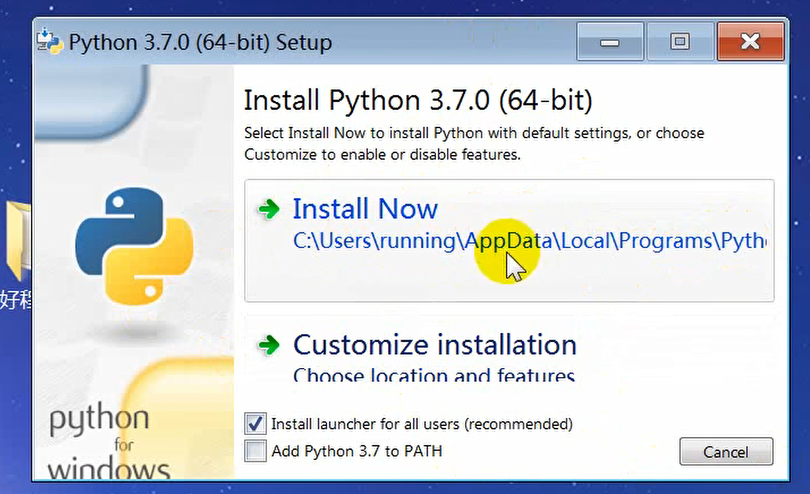

* 安装路径不可出现中文字符
* Win7系统下AppData是隐藏目录

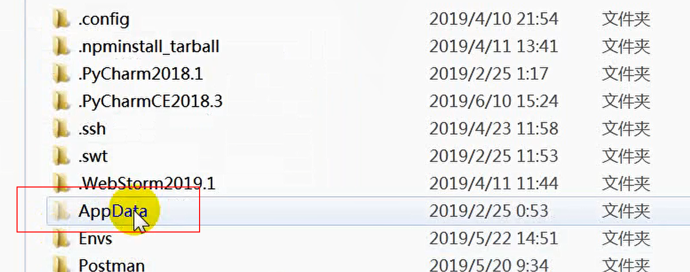

自定义安装

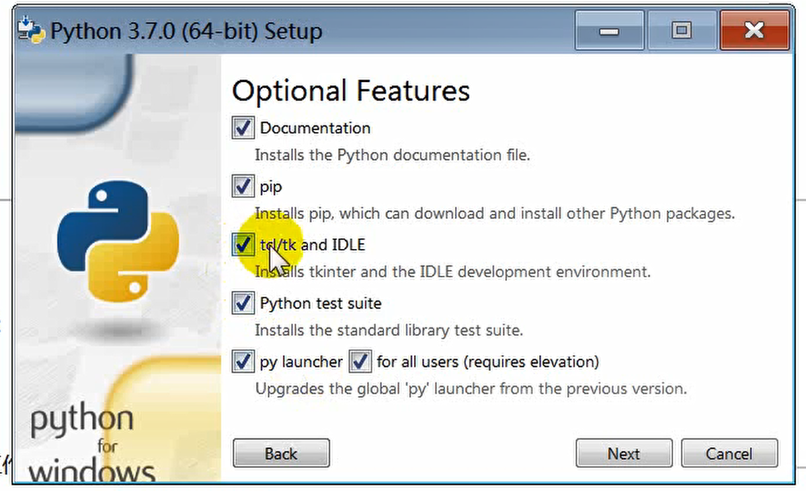

## 配置环境变量

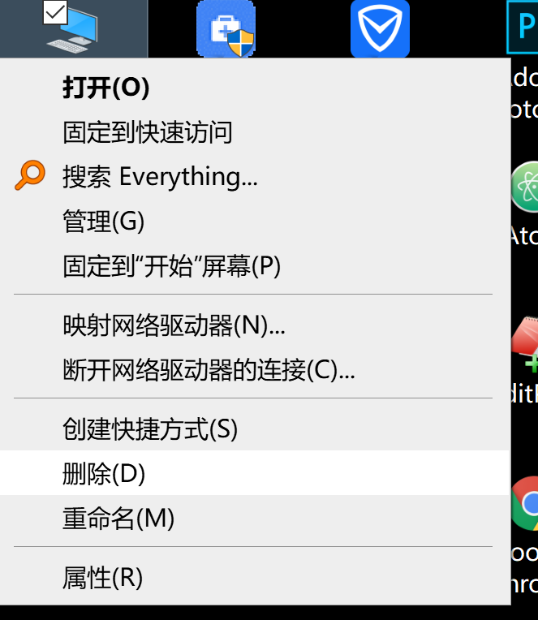

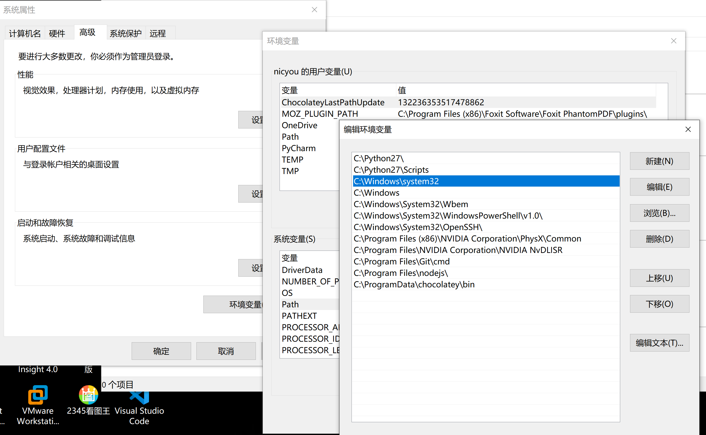

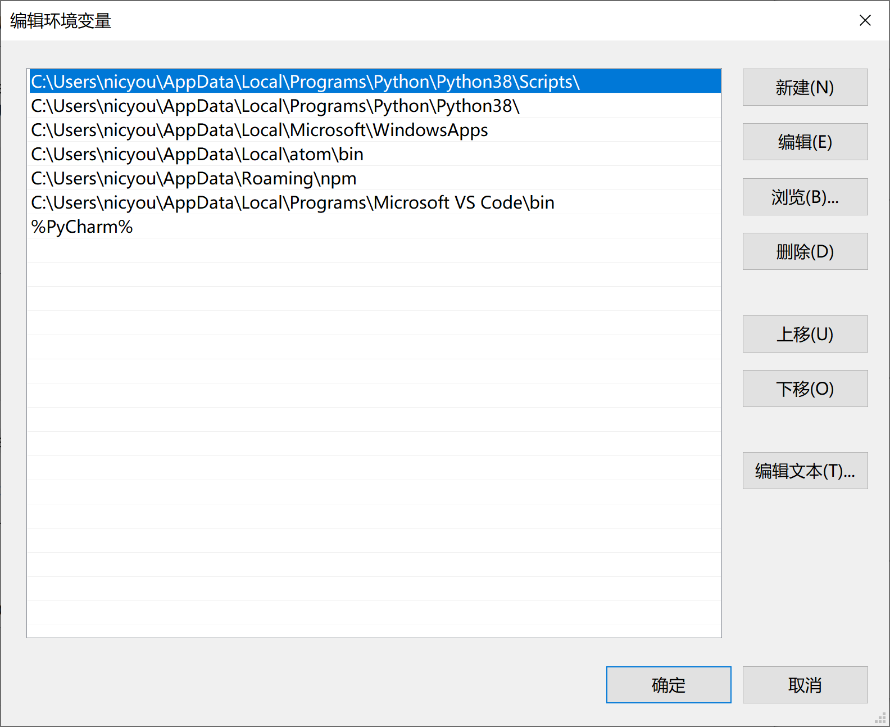

配置两个地方，

1. C:\Users\nicyou\AppData\Local\Programs\Python\Python38
2. C:\Users\nicyou\AppData\Local\Programs\Python\Python38\Scripts

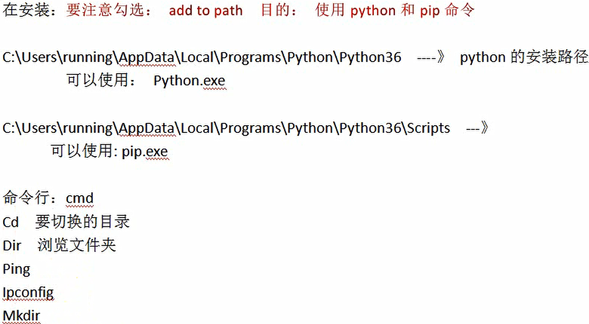

## 安装测试

分别测试pyhon和pip，版本匹配即可

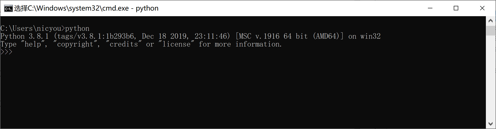

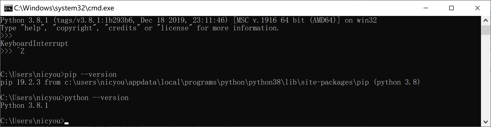

---
