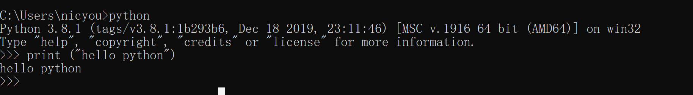
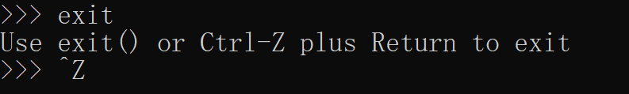
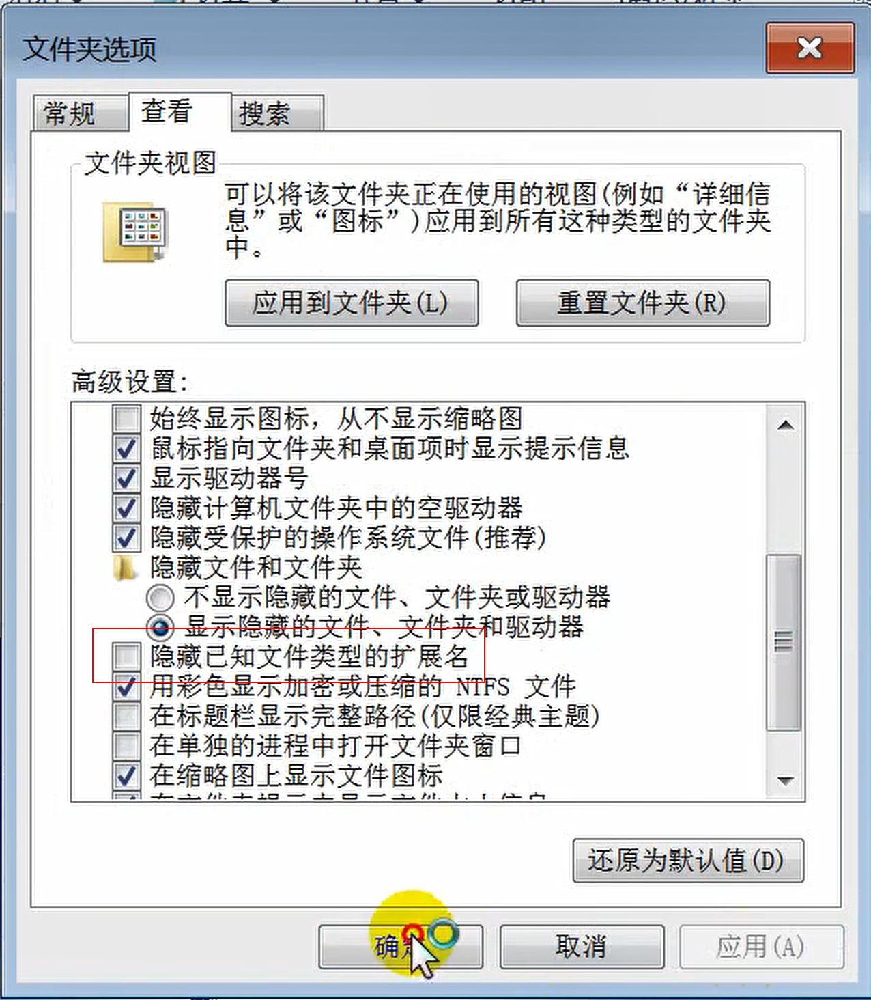

# 常用命令python与pip

## python交互式环境



* 类似于shell终端和shell脚本
* 一句一执行

* 退出终端



ctrl+z或者exit()

## python脚本

* python所有脚本都是以.py文件结尾
* 注意修改windows显示文件后缀，默认隐藏扩展名



## pip安装

* pip是python的包管理器，用于下载python第三方库
* python标准库是在python安装阶段在Lib目录下的py文件

```
C:\Users\nicyou\AppData\Local\Programs\Python\Python38\Lib
```


---
